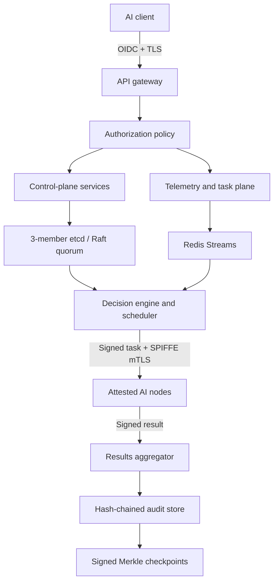
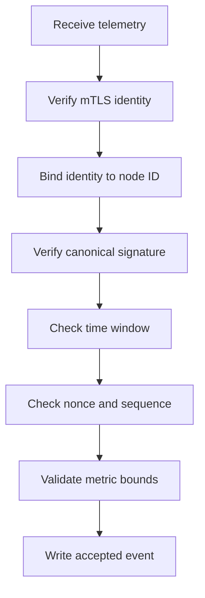

# Distributed AI Networking Platform

## Consensus, Zero-Trust Security, and Cryptographic Assurance Blueprint

**Project:** `waqas-cpu/distributed-ai-networking`  
**Document type:** Technical architecture and implementation specification  
**Status:** Proposed build plan  
**Version:** 1.0.0  
**Last updated:** 21 September 2026  
**Primary objective:** Upgrade the existing distributed AI workload-orchestration prototype into a secure, highly available, auditable, and production-oriented control plane.

---

## 1. Executive Summary

The project already contains the core components of a distributed AI orchestration system: an API gateway, telemetry ingestion, a decision engine, a scheduler, node agents, result aggregation, tests, and container-based deployment.

The next engineering step is not to turn every inference request into a blockchain transaction. The correct design is to apply strong consensus only to authoritative control-plane state while allowing telemetry and inference traffic to remain fast and scalable.

The recommended security architecture is:

> **Raft consensus + SPIFFE workload identity + TLS 1.3 mutual authentication + signed telemetry + replay protection + tamper-evident audit records + signed artifacts + hardware attestation + cryptographic agility.**

This design provides:

- High availability for control-plane state.
- Strong agreement on node membership, policies, leases, and configuration.
- Unique cryptographic identity for every workload and node.
- Protection against unauthorized services and replayed messages.
- Verifiable telemetry and scheduling decisions.
- Tamper evidence for operational and compliance audits.
- Verification of models, containers, SBOMs, and build provenance.
- A migration path toward confidential computing and post-quantum cryptography.

---

## 2. Scope

### 2.1 In scope

- Control-plane consensus and leader coordination.
- Secure node enrollment, identity, and revocation.
- Service-to-service authentication and authorization.
- Signed telemetry and replay prevention.
- Signed scheduling instructions and result envelopes.
- Tamper-evident, persistent audit records.
- Secrets and key lifecycle management.
- Model and container supply-chain verification.
- Security-focused CI/CD gates.
- Optional hardware-backed node attestation.
- Cryptographic agility and post-quantum migration readiness.

### 2.2 Out of scope for the first production milestone

- Proof of Work or Proof of Stake.
- Public blockchain settlement.
- A token or cryptocurrency.
- Global consensus for every telemetry reading or inference request.
- Fully permissionless node admission.
- Immediate post-quantum-only production cryptography.
- Byzantine consensus among mutually distrustful infrastructure operators.

---

## 3. Current-State Risk Summary

The following issues should be treated as blockers for a production deployment:

| Priority | Gap | Required response |
|---|---|---|
| Critical | Private keys are committed to the repository | Treat them as compromised, revoke them, rotate the CA and service credentials, and remove sensitive history safely. |
| Critical | A hard-coded default cluster token is available | Delete the fallback and fail closed whenever required credentials are missing. |
| Critical | Control APIs lack complete authentication and authorization | Protect inference, telemetry, audit, and administrator routes with verified identities and explicit policy. |
| High | Several nodes can share the same certificate identity | Issue a unique, short-lived identity to each workload and node. |
| High | A claimed `node_id` is not strongly bound to the authenticated identity | Derive or validate the node identifier against its SPIFFE ID and admission record. |
| High | The audit log is held in a mutable in-memory list | Store records persistently and link them cryptographically. |
| High | Redis and Grafana are configured for local convenience | Add network isolation, TLS/ACLs, authenticated access, and least privilege. |
| Medium | mTLS can be disabled | Make production startup fail if mTLS and trust material are unavailable. |
| Medium | No replicated authoritative control-plane state exists | Introduce a three-member etcd cluster using Raft. |
| Medium | CI lacks complete supply-chain security controls | Add secret, dependency, static, container, SBOM, provenance, and signature checks. |

> **Security warning:** Deleting exposed key files from the latest commit is not enough. The keys must be revoked and rotated because copies may remain in Git history, forks, caches, or clones.

---

## 4. Architectural Principles

### 4.1 Separate the control plane from the data plane

Use strong consistency for security-sensitive, authoritative state. Use high-throughput storage and streams for rapidly changing operational data.

| Plane | Examples | Consistency model | Recommended system |
|---|---|---|---|
| Control plane | Membership, admission, policy versions, leases, leader election, cluster epochs, revocations | Strong consistency | etcd with Raft |
| Telemetry plane | CPU/GPU utilization, latency, health, queue depth, bandwidth | Fresh/eventual consistency | Redis Streams or another streaming system |
| Execution plane | AI tasks, model execution, result delivery | Idempotent messaging with signed envelopes | Scheduler and node agents |
| Audit plane | Security and decision events | Append-only, persistent, tamper-evident | Database/object storage plus hash chain and signed checkpoints |

### 4.2 Zero trust

No service, machine, or network location is trusted merely because it is inside the cluster. Every request must establish:

1. **Identity** — Who sent it?
2. **Authorization** — Is that identity allowed to perform this action?
3. **Integrity** — Was the message modified?
4. **Freshness** — Is the message current rather than replayed?
5. **Provenance** — Is the software or model approved?
6. **Auditability** — Can the decision be independently verified later?

### 4.3 Fail closed

Production services must refuse to start or process privileged operations when identity, policy, consensus, signature verification, or required trust roots are unavailable.

### 4.4 Crypto agility

Algorithms, key identifiers, signature formats, and protocol versions must be explicit fields rather than hidden assumptions. This allows controlled migration from classical algorithms to hybrid and post-quantum profiles.

---

## 5. Target Architecture



### 5.1 Recommended deployment topology

- Three control-plane replicas in separate failure domains.
- Three etcd members, also separated across failure domains.
- Redis deployed privately with authentication, TLS, persistence appropriate to its role, and no public port exposure.
- At least two gateway instances behind a load balancer.
- SPIRE Server in a highly available configuration and a SPIRE Agent on each trusted machine or Kubernetes node.
- Node agents running with least-privilege service accounts.
- Audit data stored outside application memory in a durable database or append-only object store.
- KMS, HSM, or Vault used for high-value signing and encryption keys.

---

## 6. Consensus Design

### 6.1 Selected mechanism: Raft through etcd

Raft is appropriate for the current project because the control-plane replicas belong to a known administrative domain and require a replicated, ordered state machine. It provides leader election, log replication, and majority-based agreement without the cost and complexity of permissionless consensus.

For the first deployment, use **three etcd voting members**. This setup can continue operating after one member becomes unavailable, provided a majority remains connected.

### 6.2 State governed by consensus

Store only authoritative and low-to-moderate frequency state in etcd:

```text
/cluster/epoch
/cluster/schema-version
/members/{node_id}
/members/{node_id}/status
/members/{node_id}/identity
/revocations/{identity_id}
/policies/routing/{version}
/policies/security/{version}
/policies/active
/scheduler/leader
/scheduler/leases/{partition}
/config/sla/{version}
/audit/checkpoints/{checkpoint_id}
```

Every value should use a versioned schema. Security-sensitive updates must use etcd transactions or compare-and-swap operations to prevent lost updates.

### 6.3 State excluded from consensus

Do not write the following high-frequency values to etcd:

- Per-second CPU or GPU readings.
- Raw latency observations.
- Queue-depth updates.
- Request and response payloads.
- Model tensors.
- Inference result bodies.
- Full log streams.

These belong in Redis Streams, a message broker, an observability system, or durable application storage.

### 6.4 Leader election and leases

The scheduler should acquire a time-limited etcd lease. Only the current lease holder may issue authoritative scheduling decisions for its assigned partition.

Required behavior:

1. Candidate creates or attempts to acquire `/scheduler/leader` under a lease.
2. Leader periodically renews the lease.
3. If renewal fails, it immediately stops issuing new authoritative decisions.
4. Another replica acquires leadership after the lease expires.
5. Every scheduling decision includes the current `cluster_epoch`, `policy_version`, and `leader_lease_id`.
6. Nodes reject a decision from an expired lease or earlier cluster epoch.

This prevents a stale scheduler from continuing to act after losing leadership.

### 6.5 When to consider Byzantine Fault Tolerance

Raft assumes members may fail but are not intentionally malicious. Reconsider the consensus model only if control-plane validators are operated by mutually distrustful organizations such as separate cloud providers, telecoms, universities, GPU-marketplace operators, or independent data centers.

At that stage, assess a permissioned BFT protocol such as HotStuff- or Tendermint-style consensus. A typical BFT system needs `3f + 1` validators to tolerate `f` Byzantine validators. This is a future architecture decision, not a first milestone.

---

## 7. Workload Identity and Access Control

### 7.1 SPIFFE/SPIRE identity model

Replace shared, long-lived certificates with short-lived, automatically rotated workload identities.

Suggested identities:

```text
spiffe://distributed-ai.local/gateway/{instance_id}
spiffe://distributed-ai.local/scheduler/{instance_id}
spiffe://distributed-ai.local/decision-engine/{instance_id}
spiffe://distributed-ai.local/telemetry/{instance_id}
spiffe://distributed-ai.local/aggregator/{instance_id}
spiffe://distributed-ai.local/node/{node_id}
spiffe://distributed-ai.local/admin/{principal_id}
```

Each identity must map to a registered workload selector, such as a Kubernetes service account, trusted Unix process attributes, cloud instance identity, or hardware-attested node.

### 7.2 Authorization policy

Authentication proves identity; authorization determines allowed actions. Enforce least privilege with a policy engine or application-level policy layer.

| Identity | Allowed actions |
|---|---|
| Gateway | Submit validated inference requests; read active public policy metadata |
| Telemetry service | Accept telemetry from admitted node identities; write telemetry streams |
| Scheduler | Read telemetry; obtain scheduler lease; issue signed tasks |
| Node agent | Send telemetry; receive assigned tasks; return signed results |
| Aggregator | Validate results; write audit events and result metadata |
| Administrator | Change approved policies through strongly authenticated, audited workflows |

An authenticated node must never be able to claim an arbitrary `node_id`. The service must compare the message identifier with the SPIFFE identity and the membership record stored in etcd.

### 7.3 External user authentication

Use OAuth 2.0/OIDC for human users and external clients. Administrator operations should require:

- Multi-factor authentication.
- Short-lived access tokens.
- Role- or attribute-based authorization.
- Explicit audience validation.
- Audit recording.
- Optional dual approval for high-impact policy changes.

---

## 8. Cryptographic Profiles

### 8.1 Initial production profile

| Purpose | Recommended algorithm or system |
|---|---|
| Transport security | TLS 1.3 with mutual authentication |
| Workload certificates | Short-lived X.509 SVIDs issued through SPIRE |
| Message signatures | Ed25519; use ECDSA P-256 where compliance requires it |
| Key agreement | X25519 through maintained libraries/protocols |
| Symmetric encryption | AES-256-GCM or ChaCha20-Poly1305 |
| Hashing | SHA-256 or SHA-384 |
| Password hashing, if unavoidable | Argon2id with reviewed parameters |
| Artifact signing | Sigstore Cosign |
| High-value key custody | Cloud KMS, HSM, or Vault transit engine |

Do not implement cryptographic primitives manually.

### 8.2 Key-management requirements

- Generate distinct keys for distinct purposes.
- Never store private keys in Git, container images, logs, or plaintext configuration files.
- Rotate workload credentials automatically.
- Record a `key_id` and algorithm identifier with each signature.
- Keep root trust material offline or strongly protected.
- Apply least-privilege policies to signing and decryption operations.
- Define emergency revocation and recovery procedures.
- Test key rotation without service interruption.

### 8.3 Post-quantum migration

Design schemas now for hybrid support but delay broad production enablement until the selected libraries and protocols are operationally mature.

Proposed migration:

1. Classical profile: X25519 and Ed25519/P-256.
2. Hybrid key establishment: X25519 plus ML-KEM-768.
3. Hybrid signatures for selected long-lived artifacts: classical signature plus ML-DSA.
4. Policy-controlled transition to approved post-quantum profiles.

Every signed envelope should include fields such as:

```json
{
  "schema_version": "1.0",
  "signature_algorithm": "Ed25519",
  "key_id": "node-frankfurt-01-signing-2026-09",
  "signature": "base64url-value"
}
```

---

## 9. Secure Message Envelopes

### 9.1 Canonical serialization

All signed messages must use a deterministic representation. Select and document one approach, for example:

- Protobuf deterministic serialization; or
- JSON Canonicalization Scheme for JSON-based messages.

The signature must cover every field that affects security or execution. Never sign a loosely concatenated string.

### 9.2 Signed telemetry envelope

```json
{
  "schema_version": "1.0",
  "message_type": "node.telemetry",
  "node_id": "frankfurt-01",
  "identity": "spiffe://distributed-ai.local/node/frankfurt-01",
  "timestamp": "2026-09-21T10:30:00.000Z",
  "expires_at": "2026-09-21T10:30:10.000Z",
  "sequence_number": 10452,
  "nonce": "base64url-random-value",
  "metrics": {
    "cpu_utilization": 0.48,
    "gpu_utilization": 0.61,
    "queue_depth": 3,
    "latency_ms": 21.4,
    "bandwidth_mbps": 840.0,
    "healthy": true,
    "region": "eu-central"
  },
  "previous_message_hash": "sha256:...",
  "key_id": "node-frankfurt-01-signing-2026-09",
  "signature_algorithm": "Ed25519",
  "signature": "base64url-signature"
}
```

### 9.3 Telemetry verification pipeline



Reject the message if any stage fails. Security failures must produce structured audit events without logging secrets or complete sensitive payloads.

### 9.4 Replay prevention

Maintain, per node:

- Highest accepted sequence number.
- A bounded cache of recently seen nonces.
- Maximum clock-skew policy.
- Maximum message lifetime.
- Current node identity and key status.

Use an atomic operation when updating replay state. A retry may be allowed only through a documented idempotency mechanism.

### 9.5 Signed task envelope

A scheduling instruction should include:

```json
{
  "schema_version": "1.0",
  "message_type": "task.assignment",
  "task_id": "uuid",
  "idempotency_key": "uuid",
  "target_node_id": "frankfurt-01",
  "model": {
    "name": "finbert",
    "version": "3.0.0",
    "digest": "sha256:...",
    "artifact_signature_required": true
  },
  "policy_version": "routing-42",
  "cluster_epoch": 18,
  "leader_lease_id": "...",
  "issued_at": "2026-09-21T10:31:00.000Z",
  "expires_at": "2026-09-21T10:32:00.000Z",
  "input_digest": "sha256:...",
  "key_id": "scheduler-signing-2026-09",
  "signature_algorithm": "Ed25519",
  "signature": "base64url-signature"
}
```

Before execution, the node must verify the scheduler identity, message signature, target identity, epoch, leader lease, expiry, idempotency key, model digest, artifact signature, and policy constraints.

### 9.6 Signed result envelope

The node must sign result metadata containing:

- Task and idempotency identifiers.
- Node identity.
- Input digest.
- Output digest.
- Model digest.
- Runtime or container digest.
- Execution start and end times.
- Attestation reference, if required.
- Success/failure state.
- Key identifier and signature.

Sensitive result bodies should be encrypted separately; the signed envelope should carry their digest and storage reference.

---

## 10. Tamper-Evident Audit Architecture

### 10.1 Event structure

Each audit event should include:

```json
{
  "schema_version": "1.0",
  "event_id": "uuid",
  "event_type": "scheduler.decision",
  "timestamp": "2026-09-21T10:31:00.000Z",
  "actor_identity": "spiffe://distributed-ai.local/scheduler/cp-1",
  "task_id": "uuid",
  "selected_node_id": "frankfurt-01",
  "policy_version": "routing-42",
  "cluster_epoch": 18,
  "model_digest": "sha256:...",
  "decision_input_digest": "sha256:...",
  "previous_event_hash": "sha256:...",
  "event_hash": "sha256:..."
}
```

Calculate each event hash from a domain-separated, canonical encoding:

```text
event_hash = SHA-256(
  "DISTRIBUTED_AI_AUDIT_V1" ||
  previous_event_hash ||
  canonical_event_without_event_hash
)
```

### 10.2 Persistent storage

Use a durable append-oriented store. Appropriate options include:

- PostgreSQL with restrictive permissions and an append-only application model.
- Object storage with versioning and retention/WORM controls.
- A managed immutable ledger service where organizational requirements justify it.

The hash chain supplies tamper evidence; storage permissions and retention controls prevent or expose deletion and unauthorized rewriting.

### 10.3 Merkle checkpoints

At a defined interval or event count:

1. Gather the ordered event hashes.
2. Build a Merkle tree.
3. Sign the Merkle root using a protected checkpoint-signing key.
4. Write checkpoint metadata to etcd.
5. Store the full signed checkpoint in durable audit storage.
6. Optionally anchor the root to an external timestamp or ledger service when business requirements justify it.

### 10.4 Verification command

Provide a repository command similar to:

```bash
python -m tools.verify_audit \
  --from-checkpoint checkpoint-000042 \
  --to-checkpoint checkpoint-000043
```

It should verify hash linkage, canonical hashes, checkpoint signatures, event ordering, missing records, and Merkle inclusion.

---

## 11. Artifact and Model Supply-Chain Security

Every model and runtime image must be referenced by immutable digest rather than a mutable tag alone.

Required verification sequence:

1. Build the container or model package in CI.
2. Run unit, integration, vulnerability, and policy tests.
3. Generate an SBOM.
4. Produce build provenance/attestation.
5. Sign the image and approved model artifact with Sigstore Cosign or an approved KMS-backed key.
6. Store the immutable digest in the approved model registry.
7. Scheduler places the digest in the signed task envelope.
8. Node verifies digest, signature, provenance, SBOM policy, and revocation status before execution.

Recommended policy examples:

- Reject unsigned artifacts.
- Reject signatures from unapproved CI identities.
- Reject mutable tag-only references.
- Reject artifacts with critical vulnerabilities unless a documented exception exists.
- Reject artifacts whose provenance does not match the approved repository and workflow.
- Record the verified digest in the result and audit event.

---

## 12. Confidential Computing and Node Attestation

Use attestation for workloads that handle confidential, regulated, financial, or legal information.

Possible mechanisms:

- TPM 2.0 measured boot.
- AMD SEV-SNP.
- Intel TDX.
- Cloud-provider confidential VM attestation.
- ARM confidential-computing technologies for suitable edge deployments.

Admission flow:

1. Node presents platform evidence.
2. Verifier validates the evidence and reference measurements.
3. Attestation result is bound to the node identity.
4. Membership service records attestation status and expiry.
5. Policy permits or rejects the workload based on assurance requirements.
6. Attestation is refreshed periodically and after material software changes.

Attestation does not prove that every runtime metric is truthful, but it substantially raises assurance that the approved boot and runtime environment is executing.

---

## 13. Proposed Repository Structure

The exact paths can be adapted to the current codebase, but responsibilities should remain separated.

```text
distributed-ai-networking/
├── api/
│   ├── authn/
│   ├── authz/
│   ├── middleware/
│   └── routes/
├── control_plane/
│   ├── consensus/
│   │   ├── etcd_client.py
│   │   ├── keys.py
│   │   ├── leases.py
│   │   ├── membership.py
│   │   └── policy_store.py
│   └── schemas/
├── crypto/
│   ├── canonical.py
│   ├── envelopes.py
│   ├── key_provider.py
│   ├── replay_guard.py
│   ├── signatures.py
│   └── verification.py
├── identity/
│   ├── spiffe.py
│   ├── identity_binding.py
│   └── authorization.py
├── telemetry/
│   ├── ingestion.py
│   ├── validation.py
│   └── stream_store.py
├── scheduler/
│   ├── leadership.py
│   ├── signed_decision.py
│   └── task_dispatch.py
├── node_agent/
│   ├── enrollment.py
│   ├── artifact_verifier.py
│   ├── task_verifier.py
│   └── result_signer.py
├── audit/
│   ├── event.py
│   ├── hash_chain.py
│   ├── merkle.py
│   ├── checkpoint.py
│   └── persistence.py
├── attestation/
│   ├── verifier.py
│   └── policy.py
├── deploy/
│   ├── etcd/
│   ├── spire/
│   ├── policies/
│   └── observability/
├── tools/
│   ├── bootstrap_dev_identity.py
│   ├── rotate_keys.py
│   └── verify_audit.py
├── tests/
│   ├── security/
│   ├── integration/
│   ├── chaos/
│   └── conformance/
├── .github/workflows/
│   ├── ci.yml
│   ├── security.yml
│   ├── container.yml
│   └── release.yml
├── .gitignore
├── SECURITY.md
├── THREAT_MODEL.md
└── docs/
    ├── CONSENSUS_AND_SECURITY.md
    ├── KEY_ROTATION_RUNBOOK.md
    ├── NODE_ENROLLMENT_RUNBOOK.md
    └── INCIDENT_RESPONSE.md
```

---

## 14. Configuration Contract

Production must not have insecure default values.

Example configuration names:

```dotenv
APP_ENV=production
ETCD_ENDPOINTS=https://etcd-1:2379,https://etcd-2:2379,https://etcd-3:2379
ETCD_NAMESPACE=/distributed-ai
SPIFFE_TRUST_DOMAIN=distributed-ai.local
SPIFFE_ENDPOINT_SOCKET=unix:///run/spire/sockets/agent.sock
REDIS_URL=rediss://redis.internal:6379/0
OIDC_ISSUER=https://identity.example.com/
OIDC_AUDIENCE=distributed-ai-api
SIGNING_KEY_PROVIDER=kms
SIGNING_KEY_ID=distributed-ai-scheduler
AUDIT_STORE_URL=postgresql://...
AUDIT_CHECKPOINT_INTERVAL=1000
MAX_CLOCK_SKEW_SECONDS=5
TELEMETRY_TTL_SECONDS=10
REQUIRE_MTLS=true
REQUIRE_SIGNED_ARTIFACTS=true
REQUIRE_NODE_ATTESTATION=false
```

Rules:

- Do not commit `.env` files containing credentials.
- Maintain a `.env.example` containing names and safe placeholders only.
- Validate configuration at process startup.
- Refuse production startup if mTLS is false, endpoints use plaintext protocols, required identity sockets are missing, or key providers are unavailable.
- Keep development shortcuts isolated behind an explicit `APP_ENV=development` profile.

---

## 15. API Security Requirements

### 15.1 Route classification

| Route category | Authentication | Authorization | Additional controls |
|---|---|---|---|
| Public health/readiness | Optional or network-restricted | No sensitive data | Rate limiting; minimal response |
| Inference submission | OIDC client/user identity | Scope and tenant policy | Request limits; idempotency; payload encryption |
| Telemetry ingestion | SPIFFE mTLS | Node identity binding | Signature and replay verification |
| Audit retrieval | OIDC/SPIFFE | Auditor or administrator role | Pagination; redaction; access audit |
| SLA/policy administration | Strong OIDC/MFA | Administrator plus approval policy | Versioning; signed change; full audit |
| Node enrollment/revocation | SPIFFE/bootstrap identity | Membership administrator | Attestation; one-time tokens; audit |

### 15.2 General controls

- Strict request schemas and size limits.
- Rate limits by identity and tenant.
- Correlation IDs and idempotency keys.
- Content-type enforcement.
- Safe error responses without stack traces or secret values.
- Structured logging with field redaction.
- Explicit CORS policy.
- Protection against request smuggling and proxy header spoofing.
- Timeouts, bounded retries, and circuit breakers.

---

## 16. Phased Implementation Plan

### Phase 0 — Emergency credential remediation

**Goal:** Remove immediate credential exposure.

- Inventory every committed private key, certificate, token, and secret.
- Revoke and rotate exposed keys and trust roots.
- Replace the existing CA if its private key was committed.
- Remove insecure default tokens.
- Add secret patterns to `.gitignore`.
- Enable repository secret scanning and push protection.
- Remove sensitive Git history using an approved, coordinated procedure.
- Document how all collaborators must re-clone or clean their copies.

**Exit criteria:** No exposed credential remains valid, no service accepts the default token, and automated scanning detects no active secret.

### Phase 1 — Authentication, authorization, and network hardening

**Goal:** Close unauthenticated administrative and service paths.

- Require authentication on inference, telemetry, audit, and administration APIs.
- Add route-level authorization policies.
- Make production mTLS mandatory.
- Remove anonymous Grafana administrator access.
- Remove public Redis exposure; add TLS and ACLs.
- Introduce safe production configuration validation.
- Add rate limiting and secure error handling.

**Exit criteria:** Unauthorized requests are rejected in automated tests and production cannot start with an insecure configuration.

### Phase 2 — Unique workload identity

**Goal:** Give each service and node a verifiable, short-lived identity.

- Deploy SPIRE Server and agents.
- Define registration entries and selectors.
- Issue unique X.509 SVIDs.
- Bind node identifiers to SPIFFE identities.
- Define identity-based authorization policies.
- Test automatic certificate rotation and revocation.

**Exit criteria:** Shared long-lived service certificates are no longer the primary authentication mechanism.

### Phase 3 — Raft-backed control-plane state

**Goal:** Establish strongly consistent authoritative state.

- Deploy a three-member etcd cluster with TLS.
- Add versioned key schemas.
- Migrate membership, policy versions, configuration, epochs, and leases.
- Implement scheduler leader election.
- Add compare-and-swap and transaction handling.
- Add backup, restore, compaction, and disaster-recovery procedures.

**Exit criteria:** A failed leader is replaced automatically without split-brain task authorization, and state remains consistent after recovery.

### Phase 4 — Signed telemetry and replay defense

**Goal:** Authenticate and protect routing inputs.

- Implement canonical message serialization.
- Add per-node signing keys through the approved key provider.
- Add timestamps, expiries, nonces, and sequence numbers.
- Add atomic replay-state validation.
- Bind signatures to authenticated node identities.
- Add metric-range and schema validation.

**Exit criteria:** Modified, stale, replayed, wrongly identified, or incorrectly signed telemetry is rejected and audited.

### Phase 5 — Signed tasks and results

**Goal:** Protect the entire orchestration decision lifecycle.

- Sign scheduling decisions.
- Include epoch, leader lease, policy version, model digest, and expiry.
- Make execution idempotent.
- Sign result metadata and bind it to the original input and model digests.
- Encrypt sensitive payloads using envelope encryption.

**Exit criteria:** Nodes execute only fresh, authorized, correctly signed assignments and the aggregator accepts only bound, verifiable results.

### Phase 6 — Cryptographic audit ledger

**Goal:** Replace the mutable in-memory list with durable tamper evidence.

- Define canonical audit schemas.
- Persist hash-linked events.
- Generate and sign Merkle checkpoints.
- Store checkpoint metadata in etcd.
- Build an offline verification tool.
- Add retention and access-control policies.

**Exit criteria:** Any modification, removal, insertion, or reordering within a verified audit range is detected.

### Phase 7 — Secure software and model supply chain

**Goal:** Execute only approved code and models.

- Generate SBOMs.
- Scan dependencies and images.
- Produce provenance attestations.
- Sign containers and models.
- Verify signatures and provenance at the node before execution.
- Reference artifacts by immutable digest.

**Exit criteria:** Unsigned, unapproved, vulnerable beyond policy, or provenance-invalid artifacts cannot execute.

### Phase 8 — Hardware assurance and crypto agility

**Goal:** Increase trust for regulated or cross-organization workloads.

- Add TPM/TEE attestation for selected nodes.
- Bind evidence to workload identities.
- Add assurance-level routing policies.
- Introduce versioned algorithm registries.
- Prototype hybrid classical and post-quantum key establishment/signing using maintained libraries.

**Exit criteria:** High-assurance tasks are dispatched only to nodes meeting the required attestation policy, and algorithms can be migrated without changing business message semantics.

---

## 17. Testing Strategy

### 17.1 Unit tests

- Canonical serialization is stable.
- Signature creation and verification work for allowed algorithms.
- Altering any signed field invalidates the signature.
- Expired envelopes are rejected.
- Identity-to-node binding is enforced.
- Hash-chain and Merkle proofs verify correctly.
- Policy evaluation follows least privilege.

### 17.2 Integration tests

- SPIFFE identity issuance and rotation.
- mTLS success and untrusted-certificate failure.
- etcd transactional writes and watches.
- Scheduler lease acquisition and loss.
- Redis ACL and TLS enforcement.
- KMS/Vault signing.
- Cosign artifact verification.
- Persistent audit recovery after service restart.

### 17.3 Adversarial security tests

Test at least these failure cases:

| Scenario | Expected result |
|---|---|
| Modified telemetry field | Signature rejection |
| Reused nonce | Replay rejection |
| Lower sequence number | Replay/stale rejection |
| Expired task | Execution rejection |
| Node claims another `node_id` | Identity-binding rejection |
| Stale scheduler leader sends a task | Epoch/lease rejection |
| Unsigned model image | Artifact-policy rejection |
| Audit record is edited | Chain or checkpoint verification failure |
| etcd leader is terminated | New leader elected; no split-brain authorization |
| SPIRE or KMS becomes unavailable | Privileged operation fails closed |

### 17.4 Chaos and recovery tests

- Kill the current scheduler leader during dispatch.
- Partition one etcd member from the other two.
- Restart Redis and validate acceptable telemetry degradation.
- Rotate identities during active traffic.
- Restore etcd from backup into an isolated recovery environment.
- Recover audit storage and verify the last signed checkpoint.
- Simulate a revoked node attempting reconnection.

### 17.5 Performance tests

Measure:

- Signature verification latency.
- Telemetry ingestion throughput.
- Scheduler decision latency.
- Leader failover time.
- etcd transaction latency.
- Audit write and checkpoint overhead.
- Artifact verification time and cache effectiveness.

Do not remove security verification to meet performance goals. Profile, batch, cache safe public material, or scale horizontally.

---

## 18. CI/CD Security Gates

Every pull request should run:

1. Formatting and linting.
2. Type checking.
3. Unit and integration tests.
4. Static application security testing.
5. Dependency and license review.
6. Secret scanning.
7. Infrastructure and containerfile scanning.
8. Container image vulnerability scanning.
9. SBOM generation.
10. Security-policy tests.

Every approved release should additionally:

1. Build from a protected branch in a trusted runner.
2. Record immutable source revision.
3. Produce provenance.
4. Sign image and model artifacts.
5. Publish digests, not only tags.
6. Verify the signature before deployment.
7. Require protected-environment approval where appropriate.

Never expose secrets to untrusted pull-request workflows.

---

## 19. Observability and Security Monitoring

Expose metrics without sensitive payloads:

- `consensus_leader_changes_total`
- `etcd_transaction_failures_total`
- `scheduler_lease_seconds_remaining`
- `mtls_handshake_failures_total`
- `authorization_denials_total`
- `signature_verification_failures_total`
- `telemetry_replays_rejected_total`
- `node_attestation_failures_total`
- `artifact_verification_failures_total`
- `audit_checkpoint_age_seconds`
- `audit_chain_verification_failures_total`
- `credential_rotation_age_seconds`

Alert on:

- Loss of etcd quorum.
- Repeated node identity mismatch.
- Sudden signature or replay failures.
- Use of revoked identities.
- Failure to create signed audit checkpoints.
- Unsigned or unapproved artifact attempts.
- Administrator policy changes.
- Unexpected leader churn.
- Clock drift beyond the accepted limit.

Logs must use structured fields, consistent correlation IDs, bounded data, and redaction. Do not record private keys, tokens, raw authorization headers, sensitive prompts, or model outputs by default.

---

## 20. Threat Model Summary

| Threat | Primary mitigations |
|---|---|
| Node impersonation | SPIFFE identities, mTLS, node-ID binding, revocation |
| Telemetry manipulation in transit | TLS 1.3, message signatures, canonical serialization |
| Telemetry replay | Expiry, sequence number, nonce cache, atomic replay guard |
| Malicious/stale scheduler | Raft-backed leader lease, cluster epoch, signed task envelopes |
| Unauthorized policy change | OIDC/MFA, least privilege, versioning, approval, audit trail |
| Model/container substitution | Immutable digest, Cosign signature, provenance and SBOM verification |
| Audit-log tampering | Persistent hash chain, Merkle checkpoints, protected signing key |
| Secret leakage | KMS/HSM/Vault, short-lived credentials, scanning, no Git secrets |
| Compromised runtime node | Attestation, sandboxing, least privilege, workload isolation, output validation |
| Control-plane availability attack | Replication, quorum, rate limits, circuit breakers, recovery runbooks |
| Future cryptographic deprecation | Versioned algorithms, key IDs, crypto-agile schemas, hybrid migration plan |

The system cannot guarantee that a fully compromised node reports truthful resource metrics merely because its messages are signed. Signatures prove origin and integrity. Independent measurement, behavioral anomaly detection, attestation, redundancy, reputation, or economic controls are required for stronger truth assurance.

---

## 21. Definition of Done

The security and consensus upgrade is production-ready only when all of the following are true:

- [ ] All previously exposed private keys and tokens are revoked and rotated.
- [ ] No valid secret or private key is stored in Git history or container layers.
- [ ] Production has no insecure credential fallback.
- [ ] Every internal workload has a unique, short-lived identity.
- [ ] Production traffic uses TLS 1.3 and required service paths use mTLS.
- [ ] Every privileged endpoint has explicit authentication and authorization.
- [ ] Node identifiers are cryptographically bound to authenticated identities.
- [ ] Three control-plane members maintain consensus-backed authoritative state.
- [ ] Scheduler leadership uses a lease and stale leaders cannot authorize tasks.
- [ ] Telemetry supports signatures, expiry, sequence numbers, and replay prevention.
- [ ] Tasks and results use signed, versioned, canonical envelopes.
- [ ] Audit records are persistent, hash-linked, checkpointed, and independently verifiable.
- [ ] Containers and models are referenced by digest and verified before execution.
- [ ] CI generates an SBOM, provenance, scans, and signed release artifacts.
- [ ] Redis and observability systems are private and authenticated.
- [ ] Key rotation, node revocation, backup, restore, and incident-response runbooks exist.
- [ ] Unit, integration, adversarial, chaos, and recovery tests pass.
- [ ] Performance targets are met with security verification enabled.
- [ ] A formal threat-model review has no unresolved critical findings.

---

## 22. Recommended First Engineering Sprint

The first sprint should deliberately focus on risk reduction rather than Raft implementation.

### Sprint objective

Eliminate compromised credentials and close unauthenticated control paths.

### Sprint backlog

1. Inventory and revoke repository-exposed keys.
2. Generate a new trust hierarchy outside Git.
3. Remove the default cluster token and validate required configuration at startup.
4. Add `.gitignore` patterns for keys, certificates, environment files, and local secrets.
5. Add automated secret scanning to CI and developer pre-commit checks.
6. Protect administrator and audit routes with authentication and authorization.
7. Require mTLS in the production profile.
8. Remove anonymous Grafana administrator access.
9. Place Redis on a private network and enable authenticated TLS connections.
10. Add negative security tests proving unauthorized access is rejected.

### Sprint deliverables

- Updated secure configuration layer.
- Rotated development and deployment credentials.
- Protected API middleware.
- Hardened Compose/deployment configuration.
- Secret-scanning workflow.
- Security regression tests.
- `SECURITY.md` disclosure and credential-handling guidance.
- Key-rotation incident record.

---

## 23. Final Engineering Decision

The platform should evolve as a **zero-trust distributed AI orchestration system**, not as a conventional blockchain.

The recommended foundation is:

```text
Raft / etcd
    for authoritative control-plane agreement

SPIFFE / SPIRE + TLS 1.3 mTLS
    for unique workload identity and encrypted service communication

Signed canonical envelopes + replay protection
    for telemetry, tasks, and results

Hash-linked events + signed Merkle checkpoints
    for tamper-evident operational and compliance auditing

Immutable digests + SBOM + provenance + Cosign
    for model and container supply-chain integrity

KMS / HSM / Vault + optional TPM/TEE attestation
    for protected keys and higher-assurance execution

Crypto-agile schemas
    for an orderly hybrid post-quantum migration
```

This architecture preserves the low-latency character of the existing project while adding the consistency, identity, integrity, and audit controls required for a credible production-grade distributed AI infrastructure platform.

---

## 24. Reference Standards and Projects

- Raft consensus algorithm and etcd documentation.
- SPIFFE and SPIRE specifications for workload identity.
- TLS 1.3, RFC 8446.
- OAuth 2.0 and OpenID Connect.
- Sigstore Cosign for artifact signing and verification.
- SLSA framework for software supply-chain provenance.
- CycloneDX or SPDX for software bills of materials.
- NIST FIPS 203 for ML-KEM.
- NIST FIPS 204 for ML-DSA.
- NIST FIPS 205 for SLH-DSA.
- NIST guidance on zero-trust architecture and key management.
- OWASP API Security guidance.

> Before implementation, pin the versions of external specifications, libraries, and deployment components selected by the project. Validate current compliance and interoperability requirements rather than relying on this blueprint as a substitute for a formal security review.
